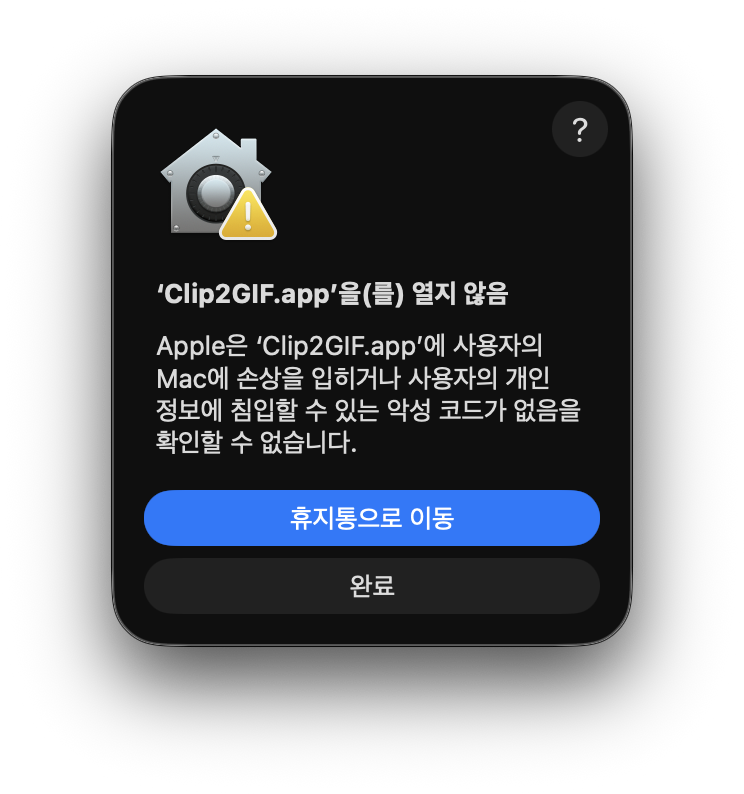
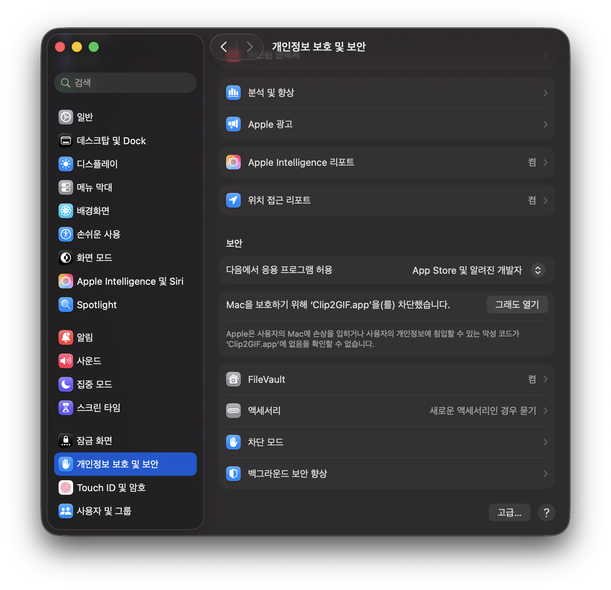

<p align="center">
  
</p>

<h1 align="center">Clip2GIF</h1>

<p align="center">macOS용 동영상 → GIF 변환 앱</p>

---

macOS용 동영상 → GIF 변환 앱입니다. 비디오를 드래그하거나 Finder에서 바로 불러와 구간·영역·품질을 조정하고 GIF로 내보냅니다. 네이티브 SwiftUI 앱이며, 프레임 추출은 AVFoundation, 인코딩은 번들된 [gifski](https://gif.ski) 바이너리를 사용합니다.

## 다운로드 & 설치

<p align="center">
  <a href="https://github.com/hdream0322/clip2gif/releases/latest">
    
  </a>
</p>

1. [**Releases 페이지**](https://github.com/hdream0322/clip2gif/releases/latest)에서 최신 `Clip2GIF-x.y.z.dmg`를 내려받습니다.
2. DMG를 열고 **Clip2GIF.app**을 **Applications** 폴더로 드래그합니다.
3. 처음 실행하면 아래처럼 *"확인할 수 없습니다"* 경고가 뜹니다. 이 앱은 Apple 공증(notarization)을 하지 않아 생기는 **정상적인 화면**이며, 한 번만 허용해 주면 다음부터는 그냥 열립니다.

   **방법 A — 시스템 설정에서 허용 (권장)**

   1. `Applications`에서 **Clip2GIF**를 더블클릭하면 이 경고가 뜹니다. 여기서 **`완료`** 를 누릅니다.
      <br>⚠️ **`휴지통으로 이동`은 절대 누르지 마세요** (앱이 삭제됩니다).

      <p align="center">
        
      </p>

   2. **시스템 설정 → 개인정보 보호 및 보안**을 열고, **보안** 항목까지 스크롤하면 *"Mac을 보호하기 위해 'Clip2GIF.app'을(를) 차단했습니다"* 가 보입니다. 옆의 **`그래도 열기`** 버튼을 누릅니다.

      <p align="center">
        
      </p>

   3. 다시 한번 확인 창이 뜨면 **`열기`** 를 누릅니다. 이후로는 일반 앱처럼 바로 실행됩니다.

   **방법 B — 터미널 한 줄 (빠른 방법)**

   ```bash
   xattr -dr com.apple.quarantine /Applications/Clip2GIF.app
   ```
   실행 후 앱을 열면 경고 없이 바로 실행됩니다.

> **지원 환경**: macOS 13.0 이상, **Apple Silicon(M1/M2/M3 등) 전용**입니다. 현재 릴리스는 번들된 gifski 인코더가 arm64 전용이라 Intel 맥은 지원하지 않습니다.

> **자동 업데이트**: 한 번 설치한 뒤로는 앱이 [Sparkle](https://sparkleproject.org)로 새 버전을 자동 확인합니다. 새 릴리스가 나오면 앱 안에서 바로 내려받아 설치하라는 안내가 뜨며, 메뉴 막대 **Clip2GIF → 업데이트 확인…** 으로 수동 확인도 가능합니다. (DMG를 다시 받을 필요 없음)

소스에서 직접 빌드하려면 아래 [설정](#설정) 섹션을 참고하세요.

## 주요 기능

- **구간 자르기 (Trim)** — 시작/끝 지점을 슬라이더로 지정
- **영역 잘라내기 (Crop)** — 정규화 좌표 기반, 비율 고정 옵션
- **출력 제어** — FPS·해상도·품질 조정
- **왕복 재생 (Bounce)** — gifski 네이티브 `--bounce`로 정주행 후 역주행 루프
- **실시간 프리뷰** — 변환 전 결과 미리보기 (역재생 포함)
- **출력 용량 추정** — 즉시 정적 추정 후, 실제 인코딩 표본으로 ±10% 정밀 재추정
- **진행률 표시** — 창 UI + Dock 아이콘 진행률 링 동시 반영
- **다중 진입점** — 드래그&드롭 · Finder 우클릭 서비스("GIF으로 변환하기") · "다음으로 열기"

## 요구 사항

- macOS 13.0 이상
- Xcode 15 이상
- [Homebrew](https://brew.sh)

## 설정

```bash
# 의존성 설치 (최초 1회)
brew install xcodegen gifski

# 프로젝트 초기화 (gifski 바이너리 복사 + .xcodeproj 생성)
./scripts/bootstrap.sh

# Xcode로 열기
open Clip2GIF.xcodeproj
```

`.xcodeproj`와 `Info.plist`는 `project.yml`에서 생성되는 산출물입니다. 직접 편집하지 말고, 새 `.swift` 파일을 추가/삭제했다면 `xcodegen generate`를 다시 실행하세요.

## 빌드 & 실행

- **Xcode**: `open Clip2GIF.xcodeproj` → ⌘B 컴파일 / ⌘R 실행 (캐시 꼬임 시 ⇧⌘K)
- **헤드리스**: `xcodebuild -project Clip2GIF.xcodeproj -scheme Clip2GIF build`

빌드에 성공하면 앱이 `/Applications/Clip2GIF.app`에 자동 설치되고 Launch Services가 갱신되어, Finder "다음으로 열기"·우클릭 서비스에서 바로 검증할 수 있습니다.

## 사용법

1. 앱에 동영상을 드래그하거나, Finder에서 동영상을 우클릭 → **GIF으로 변환하기** 선택
2. 구간(Trim)·영역(Crop)·FPS·품질·왕복 여부 설정
3. 프리뷰로 결과 확인, 예상 용량 참고
4. 변환 → GIF 저장

## 지원 포맷

입력: `mp4` · `mov` · `m4v` · `avi` · `webm`

## 문제 해결

### Finder 우클릭 → 서비스에 "GIF으로 변환하기"가 안 보일 때

macOS Services 메뉴는 기본적으로 꺼져 있는 항목이 있어, 앱을 설치해도 메뉴에 나타나지 않을 수 있습니다. 다음을 확인하세요.

1. **시스템 설정 → 키보드 → 키보드 단축키… → 서비스** 를 엽니다.
2. 목록을 아래로 내려 **파일 및 폴더**(또는 **일반**) 항목에서 **GIF으로 변환하기** 체크박스를 켭니다.
3. Finder를 재시작하면(또는 로그아웃 후 다시 로그인) 우클릭 → 서비스 메뉴에 나타납니다.

체크박스 자체가 목록에 없다면 Launch Services가 앱을 아직 인식하지 못한 경우입니다. 앱을 한 번 실행했다가 종료한 뒤 아래로 캐시를 갱신하세요.

```bash
# Launch Services 등록 강제 갱신
/System/Library/Frameworks/CoreServices.framework/Frameworks/LaunchServices.framework/Support/lsregister \
  -f /Applications/Clip2GIF.app

# Finder / 서비스 데몬 재시작
killall Finder
killall pbs
```

## 아키텍처

단일 타겟·단일 모듈 SwiftUI 앱. **Models**(값 타입·상태) → **Services**(변환 로직) → **Views**(SwiftUI) 3계층 + `AppDelegate`(서비스/"열기" 진입점) 구조입니다. 변환 파이프라인은 `FrameExtractor`(PNG 직렬 추출) → `GifskiEncoder`(gifski 프로세스 실행) 순으로 흐르며, 진행률은 `ConversionJob`이 UI와 Dock에 중계합니다. 상세 구조는 루트 [`AGENTS.md`](AGENTS.md)부터 시작하는 계층형 문서를 참조하세요.

## 라이선스

개인용 프로젝트입니다. 코드 서명·notarization 없이 로컬 빌드로 사용합니다.

이 앱은 GIF 인코딩에 [gifski](https://gif.ski)(`AGPL-3.0-only`) 바이너리를
번들·재배포합니다. gifski는 라이브러리로 링크하지 않고 별도 프로세스로
호출하므로 본 앱 소스에는 copyleft가 전파되지 않으나, 재배포되는 gifski
바이너리에는 AGPL-3.0 의무가 적용됩니다. 라이선스 전문은
[`Clip2GIF/Resources/bin/gifski-LICENSE.txt`](Clip2GIF/Resources/bin/gifski-LICENSE.txt),
대응 소스 출처·고지는 [`THIRD_PARTY_NOTICES.md`](THIRD_PARTY_NOTICES.md)를
참조하세요.
